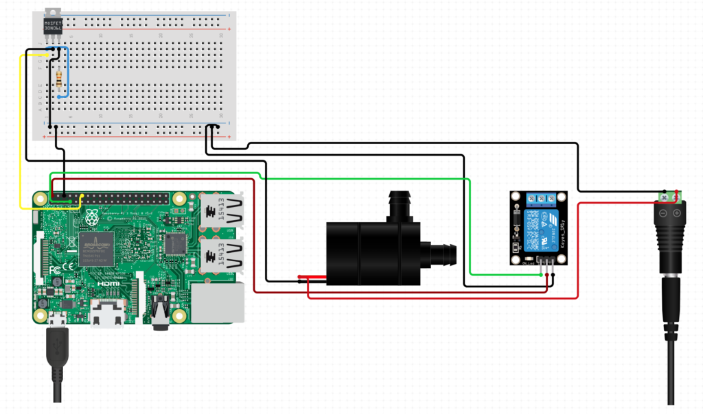
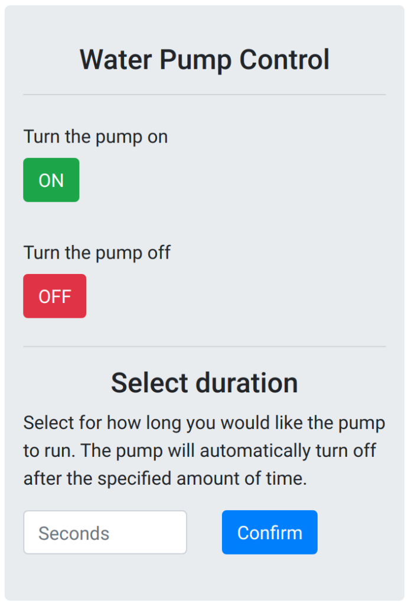

# Let's water them
Water your home plants with raspberry, a relay and a water pump.

A full description of the project is also available in my [personal blog](https://francescovigni.com/2020/09/17/lets-water-them/).

The electronics can connections can be summarized by the following sketch

Once the user visit the desired webpage `localhost:_desired_port` the app will load:

## Todo

The feature *water plants with duration* is currently blocking the app, returning the http response only after the pump finishes its job. 
It would be great to return the http response right away independently on the user input to the duration of the watering task. Feel free to submit a pr for this ;).

## License

**[MIT license](http://opensource.org/licenses/mit-license.php)**
- Copyright 2021 © Francesco Vigni